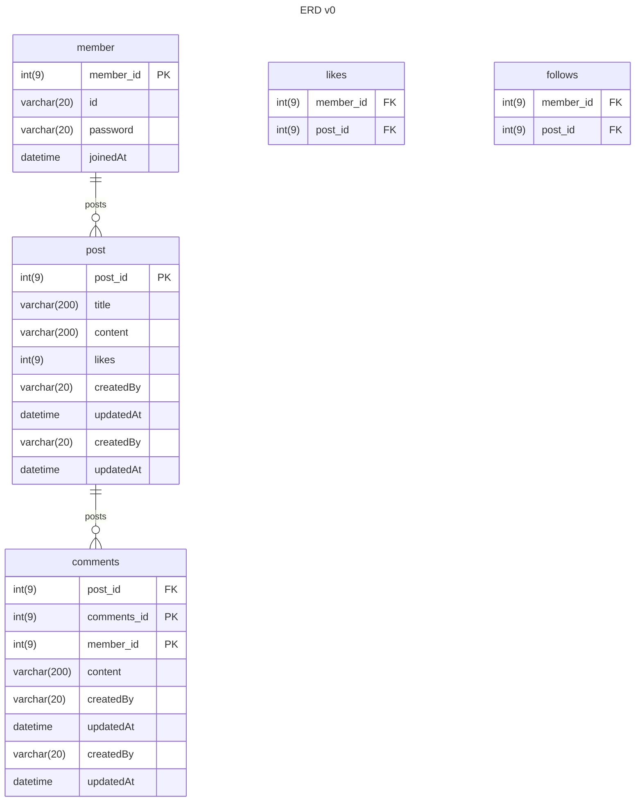

```mermaid
---
title: ERD v0
---
erDiagram
	member{
		int(9) member_id PK
	  varchar(20) id
	  varchar(20) password
	  datetime joinedAt
  }
  
  post{
	  int(9) post_id PK
	  varchar(200) title
	  varchar(200) content
	  int(9) likes
	  
	  varchar(20) createdBy
	  datetime updatedAt
	  varchar(20) createdBy
	  datetime updatedAt
  }
  
  comments{
	  int(9) post_id FK
	  int(9) comments_id PK
	  int(9) member_id PK
	  
	  varchar(200) content
	  
	  varchar(20) createdBy
	  datetime updatedAt
	  varchar(20) createdBy
	  datetime updatedAt
  }
  
  %% 다시 살펴봐야 함
  likes{
	  int(9) member_id FK
	  int(9) post_id FK
  }
  
  follows{
	  int(9) member_id FK
	  int(9) post_id FK
  }
  
  member 1 to 0+ post: posts
  post 1 to 0+ comments: posts
```
